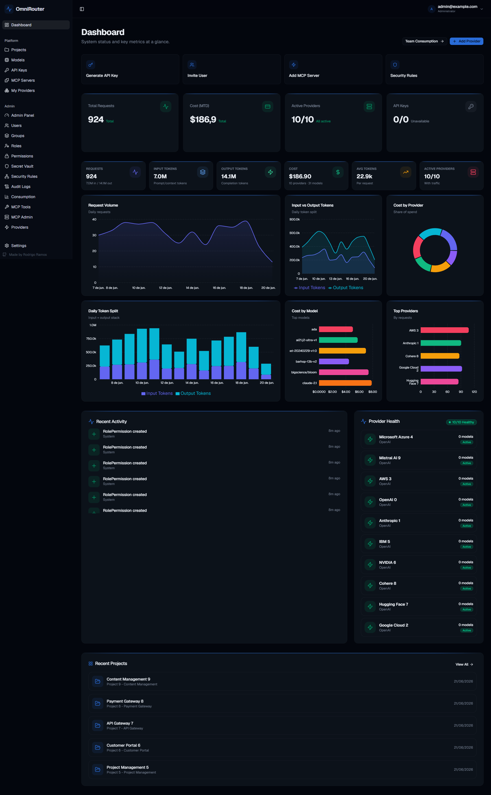

# OmniRouterAI

🌐 **English** · [Português](README.pt-BR.md)

Intelligent gateway for Large Language Model (LLM) APIs with smart routing, multilayer security, MCP (Model Context Protocol) support, and role-based access control (RBAC).

## About OmniRouterAI

Unified platform that acts as a proxy and gateway for multiple AI providers. Centralizes API key management, cost control, content security, and exposes a single interface compatible with the OpenAI API, in addition to implementing the Model Context Protocol (MCP).

## Features

| Feature | Description |
|---|---|
| **Multi-Provider Proxy** | Routes requests to 11 AI providers |
| **Smart Routing** | Intelligent routing based on rules and intent classification |
| **API Key Management** | Generation, revocation, and scoping of API keys |
| **Guard Rails** | Content filters for PII, credentials, financial, and health data |
| **Access Control (RBAC)** | 5 system roles + custom roles with 59 permissions |
| **MCP Gateway** | Discovery and execution of tools via Model Context Protocol |
| **OpenAPI Converter** | Imports OpenAPI/Swagger specs as MCP servers |
| **Geolocation and IP Rules** | Access control by country and allow/deny list by CIDR |
| **Rate Limiting** | Rate limiting by API key, project, or global |
| **Analytics and Insights** | Consumption dashboards by provider, model, project, group, and user |
| **Secret Vault** | Encrypted secret storage with environment variable resolution |
| **Auditing** | Complete tracking of all system changes |
| **Dual Authentication** | Local login (JWT) + Microsoft OAuth |

## Get Started

[📘 **Português (README.pt-BR.md)**](README.pt-BR.md) — Complete documentation in Portuguese

[📙 **English (docs/en/README.md)**](docs/en/README.md) — Full English documentation

## Supported Providers

OpenAI · Anthropic · Google Gemini · Azure OpenAI · Groq · Mistral AI · Fireworks AI · Together AI · DeepSeek · Perplexity AI · Ollama · Smart Router

## Stack

| Layer | Technology |
|---|---|
| Backend | ASP.NET Core 10 (MVC Controllers) |
| Frontend | React 19 + Vite 8 + shadcn/ui + TanStack Query |
| Database | PostgreSQL / SQLite (dev) |
| Cache | In-Memory (replaceable by Redis) |
| Auth | JWT + Microsoft Account (OAuth 2.0) |
| MCP | Model Context Protocol SDK |
