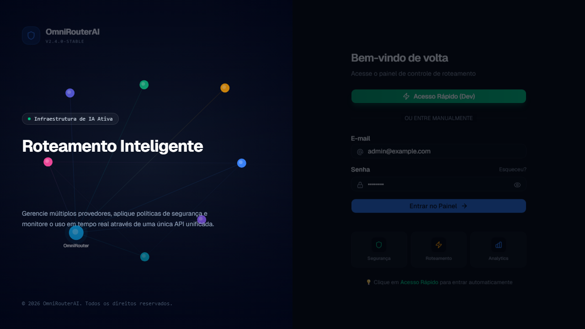

# OmniRouterAI Screens

## Authentication

### Login (`/auth/login`)

Two-column login page with an authentication form and an animated neural network background.

- Email and password login
- "Sign in with Microsoft" button (OAuth)
- Legacy hash token support (hidden field)
- Dev mode shows pre-filled admin credentials

---

## Dashboard

### Dashboard (`/` or `/dashboard`)

Main page after login, displaying:

- **Quick Actions:** Generate API Key, Invite User, Add MCP Server, Security Rules
- **Stats Grid:** Total requests, tokens, cost, active providers
- **Usage Charts:** Consumption over time
- **Recent Activity:** Latest requests in a timeline
- **Provider Health:** Status of each provider (online/offline)
- **Recent Projects:** List of recently accessed projects

---

## Platform

### Projects (`/projects`)

Permission: `projects:view`

Full project CRUD:

- Paginated list with search
- Create, edit, and delete projects
- Manage project members (add/remove users)
- Link groups to projects
- Copy project ID
- Navigate to project API keys

### Models (`/models`)

Permission: `models:view`

Browse all available AI models:

- Grid/list view toggle
- Search/filter by model name
- Shows model ID, provider, status, and creation date

### API Keys (`/apikeys`)

Permission: `apikeys:view`

Full API key lifecycle management:

- Select linked project
- Name and expiration (7d/30d/90d/1yr/never)
- Access type: Models, MCPs, or Both
- Granular scopes: per-provider and per-model restrictions
- One-time secret display
- Copy with security warning
- Revoke and delete
- View prefix, expiration, and usage metrics

### MCP Servers (User) (`/mcp`)

Permission: `mcp:servers:view`

User-facing MCP server view:

- Expandable server cards with tools
- Refresh/discover tools
- API documentation panel
- Warning banner for unreachable servers

### My Providers (`/my-providers`)

Permission: `providers:view`

Read-only view of providers and models available to the authenticated user's API keys.

### Request Logs (`/logs`)

Permission: `consumption:view:all`

Real-time traffic monitoring:

- Paginated searchable request table
- User filter (combobox)
- Columns: timestamp, model, provider, tokens (prompt/completion), cost (USD), status code
- Summary cards: total requests, tokens, cost

---

## Administration

### Admin Panel (`/admin`)

Permission: `admin:access`

Central admin hub with links to all administrative sections:

- Shortcut grid: Users, Groups, Roles, Permissions, MCP Servers, Team Consumption
- Secret Vault summary cards (count per type)
- Providers table
- Security rules link

### Users (`/admin/users`)

Permission: `users:manage`

User management:

- Full CRUD: create, edit, delete
- Fields: email, password, display name, role (User/Manager/Viewer/MCP User/Administrator)
- Paginated table with search
- User status badges

### Groups (`/admin/groups`)

Permission: `groups:view`

Group management:

- CRUD: create, edit, delete groups
- Member management: add/remove users via search combobox
- Grid/list view toggle

### Roles (`/admin/roles`)

Permission: `roles:manage`

Role profile management with granular permissions:

- CRUD for system and custom roles
- Categorized permission matrix with switches
- Group scope assignment
- System role badge indicator
- Permission category icons

### Permissions (`/admin/permissions`)

Permission: `permissions:view`

Group-based visibility management:

- Select a group
- Toggle provider, MCP server, and project visibility
- Grant/revoke provider access to users or groups (with model-level granularity)

### Providers (`/admin/providers`)

Permission: `providers:view`

Full provider management:

- CRUD for AI providers (OpenAI, Anthropic, Ollama, Azure OpenAI, Smart Router)
- Sheet-based editor
- Settings: auth type (API Key, Bearer Token, Google Service Account, Google ADC), connection test, model fetch
- Custom headers, priority, cost per 1k tokens
- Group assignment
- Smart Routing rules (fallback, conditional rules)
- Guard Rails per provider (PII/Credentials/Financial/Health)
- Toggle active/inactive
- Test inference dialog

### New Provider Wizard (`/admin/providers/new`)

Permission: `providers:create`

Step-by-step wizard for creating a new provider.

### MCP Servers (Admin) (`/admin/mcp`)

Permission: `mcp:servers:view`

Administrative MCP server management:

- CRUD for MCP servers (HTTP JSON-RPC, SSE, OpenAPI)
- Settings: name, slug, URL, type, custom headers (with Secret Vault support)
- Visibility: public or per-group
- Guard Rails per server
- Tool discovery/refresh
- OpenAPI spec import
- Plugin sync
- Group access view

### MCP Tools (`/admin/mcp-tools`)

Permission: `mcp:tools:call`

Interactive MCP tool execution:

- Select server and tool
- Fill type-aware parameters
- Execute tool
- View JSON result with execution time

### MCP Builder / OpenAPI Converter (`/admin/converter`)

Permission: `mcp:servers:create`

Two options for creating MCP servers:

1. **Import OpenAPI:** URL, file upload, or raw JSON → global/auth config → endpoint mapping → preview → deploy
2. **Custom Builder:** Wizard for manually defining tools with parameters, input/output schemas, custom headers

### Secret Vault (`/admin/secrets`)

Permission: `secrets:view`

Encrypted secrets management:

- CRUD for secrets
- Types: token, API key, password, header, Google Service Account JSON, Google ADC
- Masked values in the UI
- Environment variable resolution (`${VAR}` with default support `${VAR:-default}`)
- Health check showing unresolved env vars

### Team Consumption (`/admin/consumption`)

Permission: `consumption:view:team`

Team usage analytics dashboard:

- Filters: project, provider, group
- Stat cards: members, requests, input/output tokens, cost
- Charts: daily requests (area), input vs output (line), cost by provider (donut), tokens (stack)
- Rankings: top members, top cost, top projects/providers/groups
- Member breakdown table
- Group consumption cards

### Security Rules (`/admin/security`)

Permission: `security:view`

Network security rule management:

- Tabs for IP Rules and Geo Rules
- IP Rules: allowlist/denylist by CIDR
- Geo Rules: block/allow by country code (ISO 3166-1 alpha-2)
- Paginated CRUD table

### Audit Logs (`/admin/audit`)

Permission: `audit:view`

System audit log viewer:

- Filters: entity (combobox), action (Create/Update/Delete), user, date range (calendar pickers)
- Paginated table with detail sheet
- Info: entity, action, timestamp, user, IP, key values, changed fields (old/new values)

### Settings (`/settings`)

Permission: `settings:view`

Global application settings in tabs:

- **General:** Server name, base URL, CORS
- **Routing:** Auto-fallback, load balancing, default model
- **Security:** Require API key, rate limit, max tokens, global policies (RPS/RPM/TPM/burst)
- **Advanced:** Request logging, token tracking
- Toggle switches with optimistic debounced save
