# Telas do OmniRouterAI

## Autenticação

### Login (`/auth/login`)

Tela de login com duas colunas: formulário de autenticação e fundo animado com rede neural.

- Login com e-mail e senha
- Botão "Entrar com Microsoft" (OAuth)
- Suporte a legacy hash token (campo oculto)
- Em ambiente de desenvolvimento, exibe credenciais de admin pré-preenchidas

---

## Dashboard

### Dashboard (`/` ou `/dashboard`)

Página principal após o login. Exibe:

- **Botões de Ação Rápida:** Gerar API Key, Convidar Usuário, Adicionar Servidor MCP, Regras de Segurança
- **Grid de Estatísticas:** Total de requisições, tokens, custo, provedores ativos
- **Gráficos de Uso:** Consumo ao longo do tempo
- **Atividade Recente:** Últimas requisições em timeline
- **Saúde dos Provedores:** Status de cada provedor (online/offline)
- **Projetos Recentes:** Lista dos últimos projetos acessados

---

## Plataforma

### Projetos (`/projects`)

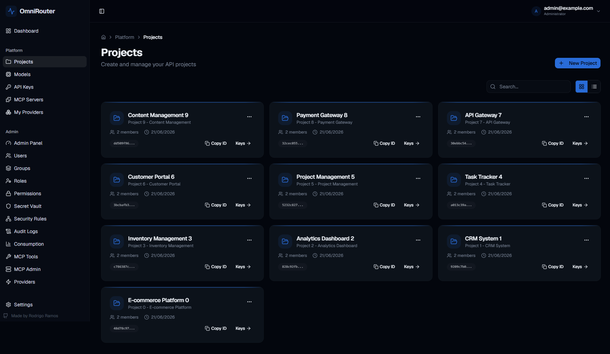

Permissão: `projects:view`

CRUD completo de projetos:

- Lista paginada com busca
- Criar, editar e excluir projetos
- Gerenciar membros do projeto (adicionar/remover usuários)
- Vincular grupos ao projeto
- Copiar ID do projeto
- Navegar para chaves de API do projeto

### Modelos (`/models`)

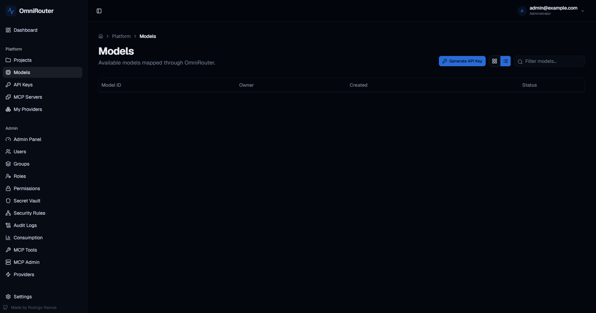

Permissão: `models:view`

Visualização de todos os modelos de IA disponíveis:

- Alternância entre visualização em grid e lista
- Busca/filtro por nome do modelo
- Exibe ID do modelo, provedor, status e data de criação

### API Keys (`/apikeys`)

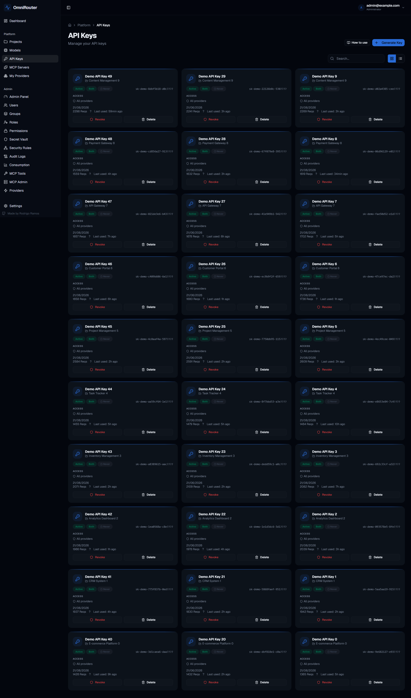

Permissão: `apikeys:view`

Gerenciamento completo do ciclo de vida de chaves:

- Selecionar projeto vinculado
- Nome e prazo de expiração (7d/30d/90d/1yr/sem expiração)
- Tipo de acesso: Models, MCPs ou Ambos
- Escopos granulares: restrição por provedor e modelo
- Geração com exibição única do segredo
- Cópia do segredo com aviso de segurança
- Revogação e exclusão
- Visualização de prefixo, expiração e métricas de uso

### MCP Servers (Usuário) (`/mcp`)

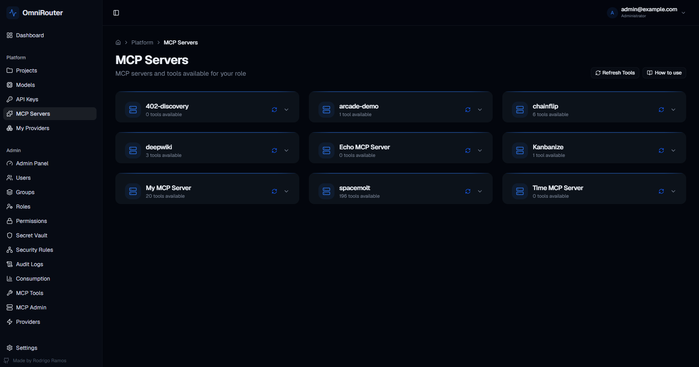

Permissão: `mcp:servers:view`

Visualização dos servidores MCP disponíveis para o usuário:

- Cards expansíveis com ferramentas do servidor
- Atualização/descoberta de ferramentas
- Painel de documentação da API
- Banner de aviso para servidores inacessíveis

### Meus Provedores (`/my-providers`)

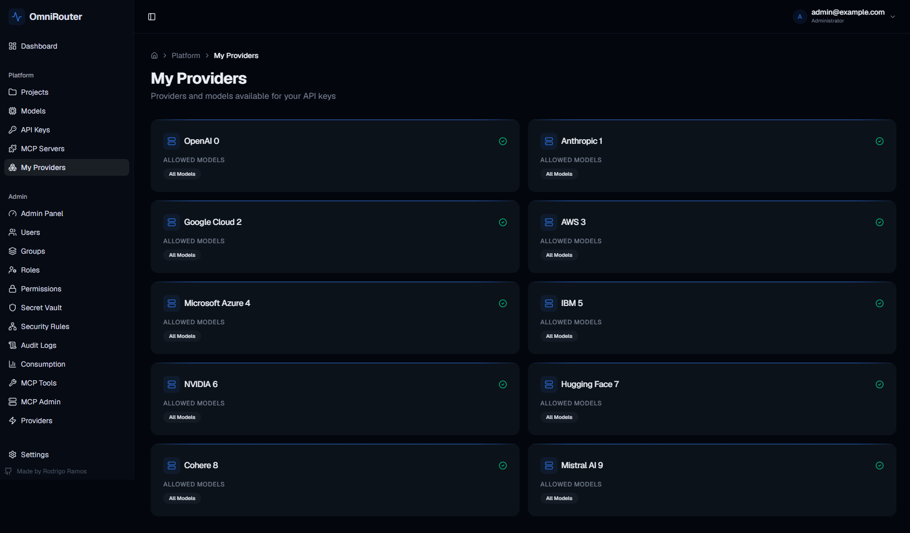

Permissão: `providers:view`

Visualização somente leitura dos provedores e modelos permitidos para as chaves do usuário autenticado.

### Logs de Requisição (`/logs`)

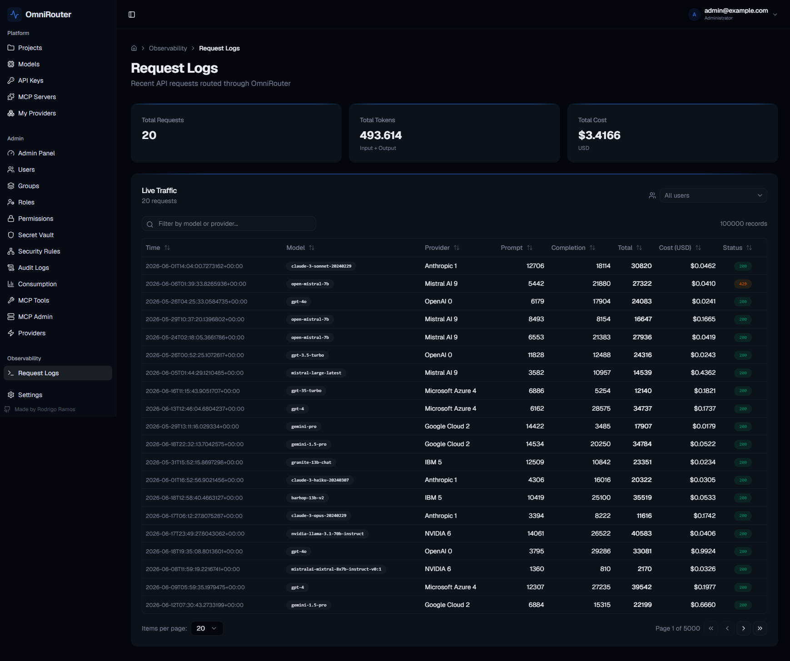

Permissão: `consumption:view:all`

Monitoramento de tráfego em tempo real:

- Tabela paginada e buscável de requisições
- Filtros por usuário (combobox)
- Colunas: timestamp, modelo, provedor, tokens (prompt/completion), custo (USD), código de status
- Cards de resumo: total de requisições, tokens, custo

---

## Administração

### Painel Admin (`/admin`)

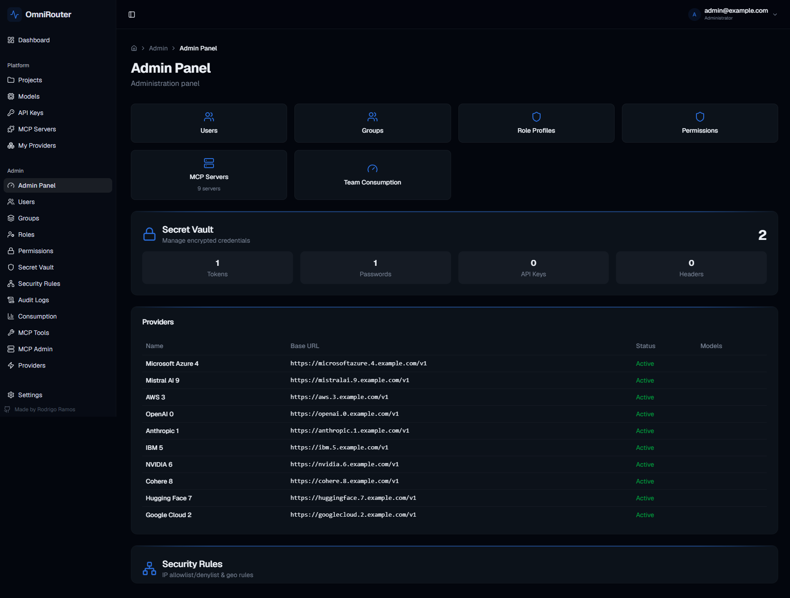

Permissão: `admin:access`

Hub central da administração com links para todas as seções administrativas:

- Grid de atalhos: Usuários, Grupos, Papéis, Permissões, Servidores MCP, Consumo do Time
- Cards de resumo do Secret Vault (quantidade por tipo)
- Tabela de provedores
- Link para regras de segurança

### Usuários (`/admin/users`)

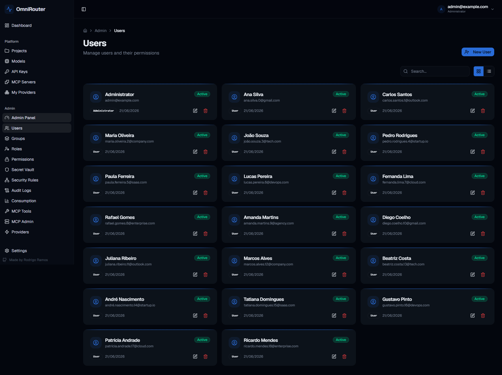

Permissão: `users:manage`

Gerenciamento de usuários da plataforma:

- CRUD completo: criar, editar, excluir
- Campos: e-mail, senha, nome de exibição, papel (User/Manager/Viewer/MCP User/Administrator)
- Tabela paginada com busca
- Badges de status do usuário

### Grupos (`/admin/groups`)

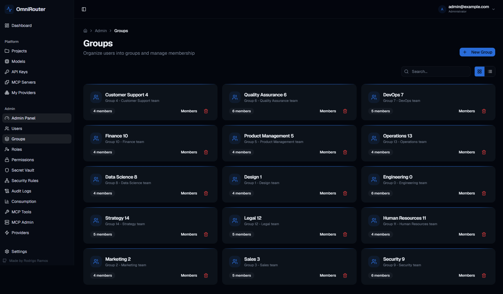

Permissão: `groups:view`

Gerenciamento de grupos de usuários:

- CRUD: criar, editar, excluir grupos
- Gerenciar membros: adicionar/remover usuários via combobox de busca
- Alternância entre visualização grid e lista

### Papéis (Role Profiles) (`/admin/roles`)

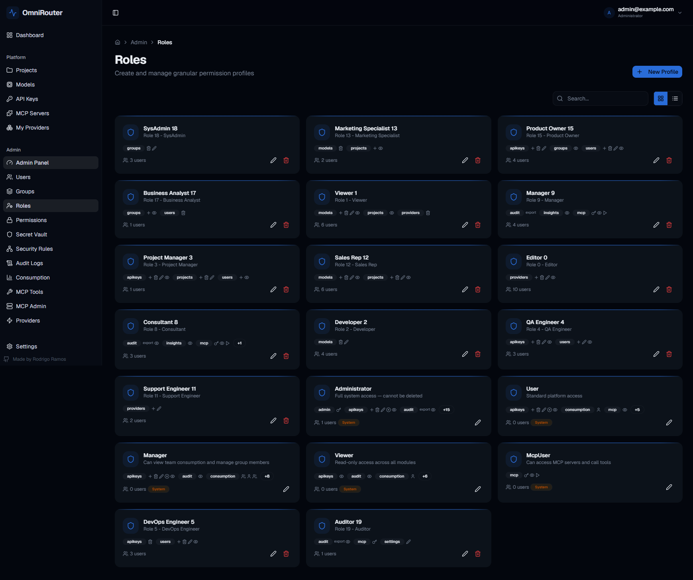

Permissão: `roles:manage`

Gerenciamento de perfis de papel com permissões granulares:

- CRUD de papéis de sistema e customizados
- Matriz de permissões por categoria com switches
- Atribuição de escopo de grupo
- Badge indicando papel de sistema vs customizado
- Ícones visuais por categoria de permissão

### Permissões (`/admin/permissions`)

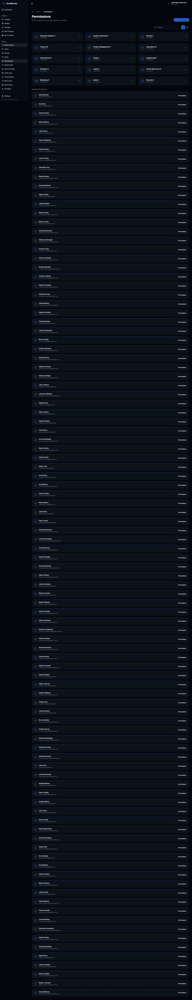

Permissão: `permissions:view`

Gerenciamento de visibilidade baseada em grupos:

- Selecionar grupo
- Configurar quais provedores, servidores MCP e projetos são visíveis para o grupo
- Concessão/revogação de acesso a provedores para usuários ou grupos (com granularidade de modelo)

### Provedores (`/admin/providers`)

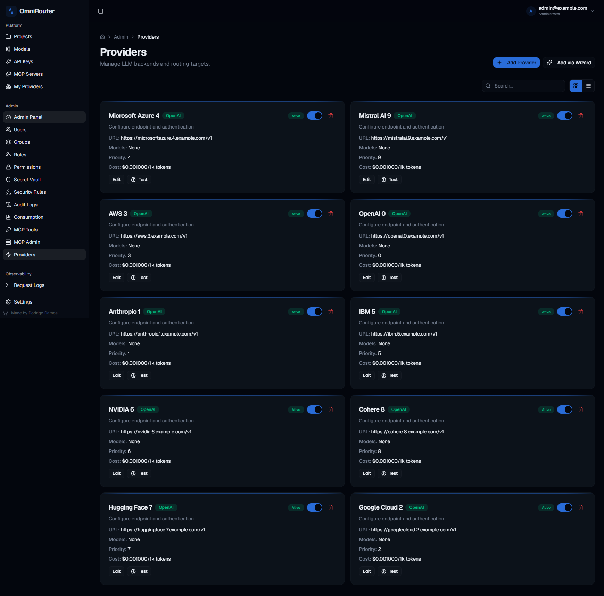

Permissão: `providers:view`

Gerenciamento completo de provedores de IA:

- CRUD de provedores (OpenAI, Anthropic, Ollama, Azure OpenAI, Smart Router)
- Editor em sheet lateral
- Configurações: tipo de autenticação (API Key, Bearer Token, Google Service Account, Google ADC), teste de conexão, busca de modelos
- Headers customizados, prioridade, custo por 1k tokens
- Atribuição de grupos
- Regras de Smart Routing (fallback, regras condicionais)
- Guard Rails por provedor (PII/Credentials/Financial/Health)
- Ativar/desativar provedor
- Teste de inferência (dialogo)

### Novo Provedor (Wizard) (`/admin/providers/new`)

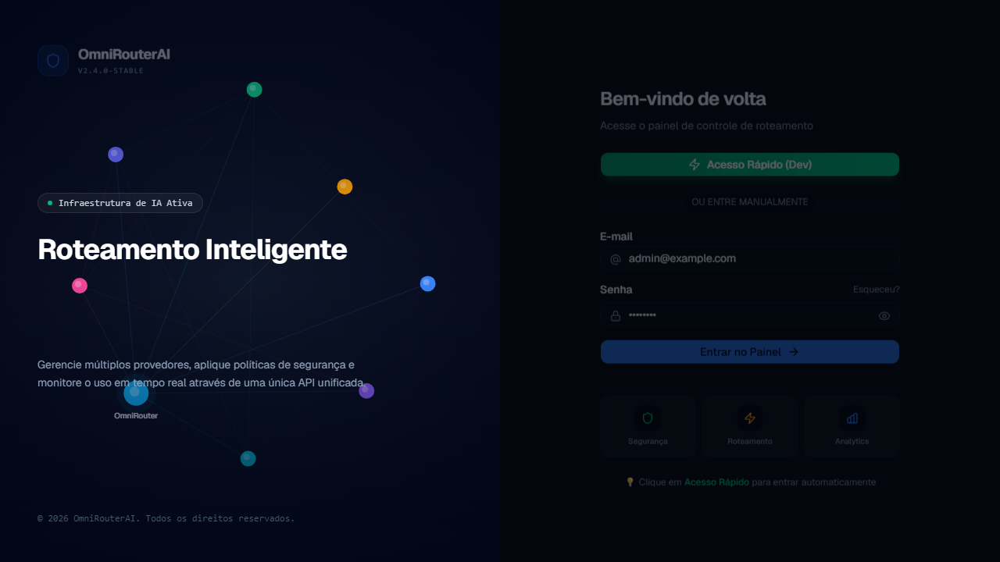

Permissão: `providers:create`

Assistente passo a passo para criar um novo provedor.

### Servidores MCP (Admin) (`/admin/mcp`)

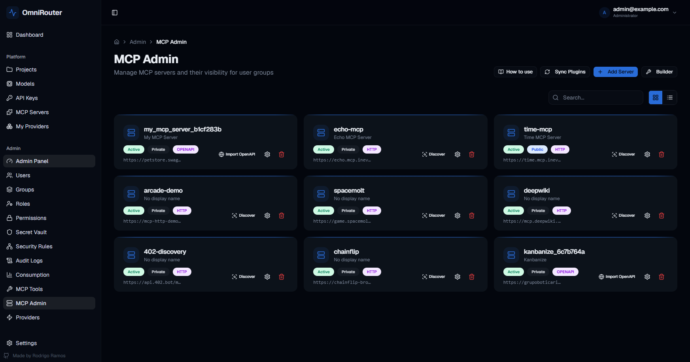

Permissão: `mcp:servers:view`

Gerenciamento administrativo de servidores MCP:

- CRUD de servidores MCP (tipos: HTTP JSON-RPC, SSE, OpenAPI)
- Configurações: nome, slug, URL, tipo, headers customizados (com suporte a Secret Vault)
- Visibilidade: público ou por grupo
- Guard Rails por servidor
- Descoberta/atualização de ferramentas do servidor
- Importação de specs OpenAPI
- Sincronização de plugins
- Visualização de acesso por grupo

### MCP Tools (`/admin/mcp-tools`)

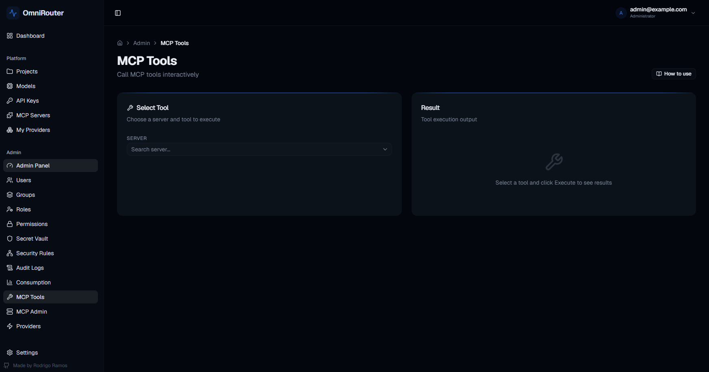

Permissão: `mcp:tools:call`

Execução interativa de ferramentas MCP:

- Selecionar servidor e ferramenta
- Preencher parâmetros com campos type-aware
- Executar a ferramenta
- Visualizar resultado JSON com tempo de execução

### MCP Builder / OpenAPI Converter (`/admin/converter`)

Permissão: `mcp:servers:create`

Duas opções para criar servidores MCP:

1. **Importar OpenAPI:** URL, upload de arquivo ou JSON bruto → configuração global/auth → mapeamento de endpoints → preview → deploy
2. **Builder Customizado:** Wizard para definir ferramentas manualmente com parâmetros, schemas de entrada/saída, headers customizados

### Secret Vault (`/admin/secrets`)

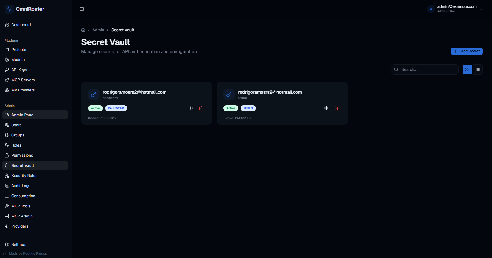

Permissão: `secrets:view`

Gerenciamento de segredos criptografados:

- CRUD de segredos
- Tipos: token, API key, password, header, Google Service Account JSON, Google ADC
- Valores mascarados na interface
- Resolução de variáveis de ambiente (`${VAR}` com suporte a valor default `${VAR:-default}`)
- Health check mostrando variáveis de ambiente não resolvidas

### Consumo do Time (`/admin/consumption`)

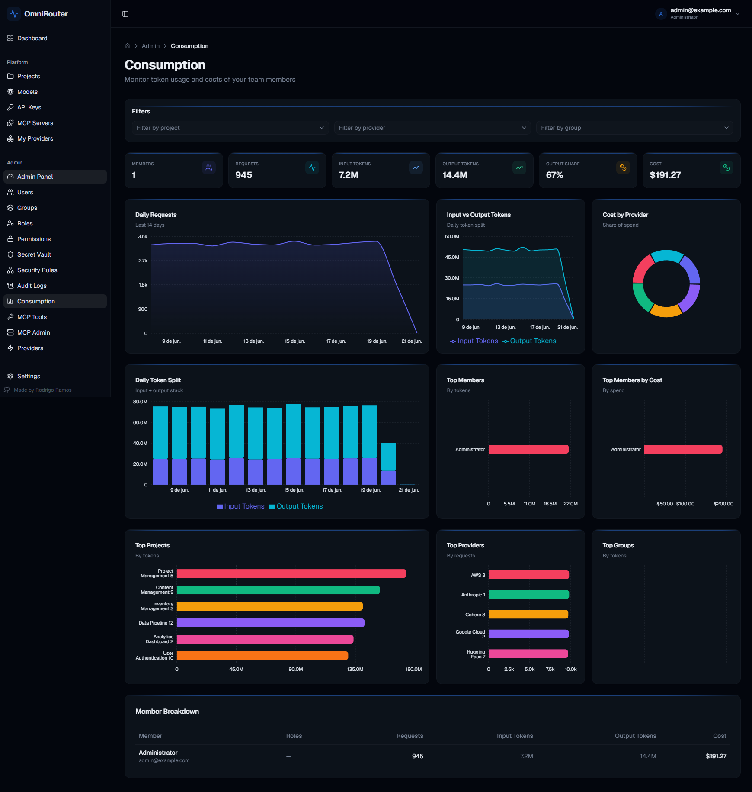

Permissão: `consumption:view:team`

Dashboard de analytics de uso do time:

- Filtros por projeto, provedor e grupo
- Cards de estatísticas: membros, requisições, tokens input/output, custo
- Gráficos: requisições diárias (área), input vs output (linha), custo por provedor (donut), tokens (stack)
- Rankings: top members, top cost, top projects/providers/groups
- Tabela de membros com valores individuais
- Cards de consumo por grupo

### Regras de Segurança (`/admin/security`)

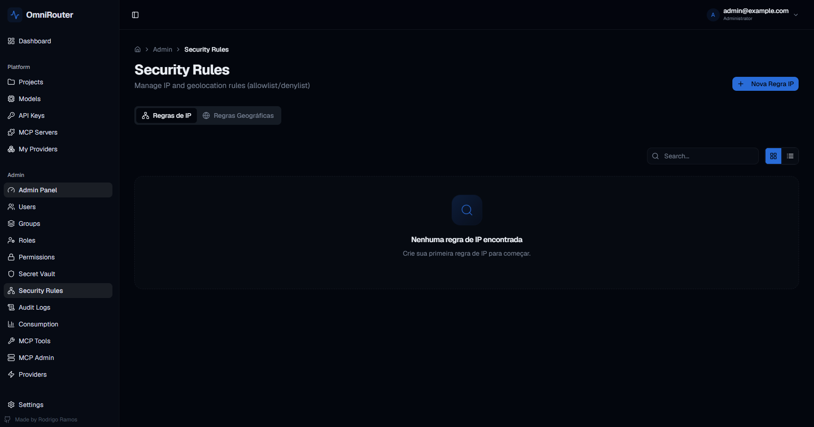

Permissão: `security:view`

Gerenciamento de regras de segurança de rede:

- Abas para IP Rules e Geo Rules
- IP Rules: lista de permissão/negação por CIDR
- Geo Rules: bloqueio/permissão por código de país (ISO 3166-1 alpha-2)
- CRUD com tabela paginada

### Auditoria (`/admin/audit`)

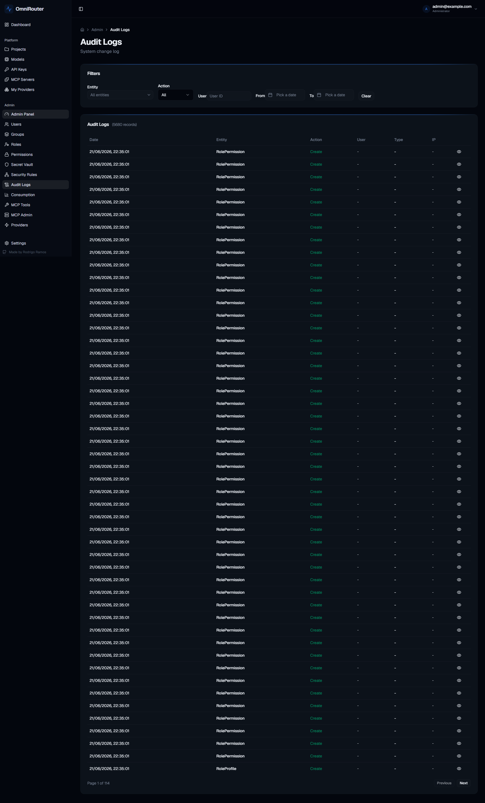

Permissão: `audit:view`

Visualização de logs de auditoria do sistema:

- Filtros: entidade (combobox), ação (Create/Update/Delete), usuário, período (calendário)
- Tabela paginada com detalhes em sheet lateral
- Informações: entidade, ação, timestamp, usuário, IP, key values, campos alterados (valores antigos/novos)

### Configurações (`/settings`)

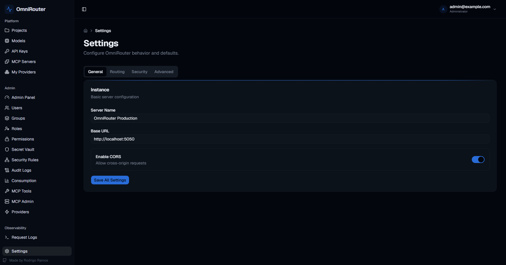

Permissão: `settings:view`

Configurações globais da aplicação em abas:

- **Geral:** Nome do servidor, URL base, CORS
- **Roteamento:** Fallback automático, balanceamento, modelo padrão
- **Segurança:** Exigir API Key, limite de taxa, max tokens, políticas globais (RPS/RPM/TPM/burst)
- **Avançado:** Logging de requisições, rastreamento de tokens
- Switches com salvamento otimista (debounced)
